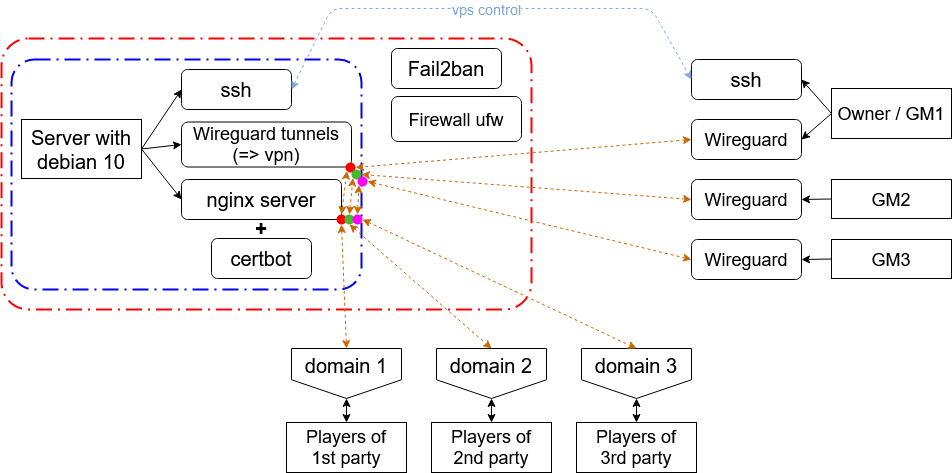

# Proxy server for Foundryvtt (GM's PC - Wireguard - nginx) 

//the translation and editing is in the process

Below is one of the options for configuring a server with debian 10 for proxying traffic from a local GM machine connected to a VLAN using Wireguard, on the one hand, to a player's computer connected through a browser to a domain on the Internet via a secure https connection, on the other hand ( and back). Allows to drive parties to several GMs at the same time, using one server (while choosing the minimum tariff plan vps / vds, if the server is rented). 

<details>
<summary>Advantages and disadvantages of this approach (may be subjective)</summary>

The advantages of this approach are that:
1) In comparison with renting a full-fledged server for hosting Foundryvtt, you can minimize costs, because a weak machine is enough to proxy traffic.
2) In comparison with placing Foundryvtt on a remote rented server, in this case you will prepare for games from your personal computer, without wasting time for receiving and sending traffic (if you keep your personal server at home, then, of course, delays are minimized).
3) Compared to hosting Foundryvtt on a personal home server, there is no need to worry about fire safety.
4) Compared to placing Foundryvtt on a personal computer and sharing access to Foundryvtt using nginx, you do not need to re-configure your personal computer to send data over the network in case of reinstalling the operating system, the logic of communication over the network is located on the vps side (not counting ssh and wireguard connections). You just need to install wireguard, add configuration to it and open a UDP port in the firewall. No additional Foundryvtt configuration is required. Thus, the configuration process is minimally dependent on the specific operating system that is installed on the personal computers of GMs that use this server. 
5) Compared to hosting Foundryvtt on a personal computer and sharing access to Foundryvtt using nginx, here on a personal computer you do not need to open TCP ports 80 (http), 443 (https).
6) Compared to connecting players via a virtual private network, here players do not need to deal with this connection, just go to the domain name in the browser.
7) Allows to use one vps / vds server for several GMs. 

The disadvantages are that:
1) Players will only have access to Foundryvtt when the personal computer is turned on and wireguard and Foundryvtt are running and connected.
2) You will be limited in choosing a provider for vps / vds, because:
    * The server (from experience) makes sense to search within the same city where the master is connected to the Internet (physically). For example, if the master is in St. Petersburg and the server is in Moscow, delays will be noticeable.
    * It also makes sense to choose a provider and tariff in order to have access through vnc in order to have more control over the machine. On the other hand, connection stability and low latency may be more important. 

</details>

These commands are given for a server on debian> = 10, most likely, they are also correct without changes for Ubuntu> = 20 (>=18?), For another distribution you need to make the appropriate adjustments. Server side actions are highlighted with a red circle &#x1F534; at the beginning. On the client side, I used Ubuntu 20, all relevant actions are highlighted in blue &#x1F535; at the beginning (ubuntu was deployed inside a virtualbox virtual machine, the very fact of virtualization does not affect the type of commands). For another system, you will need to make the appropriate changes. 

Briefly about what will be done below: 



## 1. vps/vds-provider

The provider will provide a password for the user **root** -
**\<root_password\>** (let's say by mail).

User: root

Password: \<root_password\>

Article 1:
<https://habr.com/ru/company/vdsina/blog/521388/>

Article 2:
<https://timeweb.com/ru/help/pages/viewpage.action?pageId=9241442>

&#x1F534; If you need to immediately change the password for root:

```
passwd root
```

## 2. Server preparation

We update the list of packages from the repositories, update all installed packages to the current version. 

```
apt-get update

apt-get upgrade
```

## 3. Non-root user, on the server 

Since the root user has absolute privileges in the system, in order to prohibit him from remote administration, we will create a non-root user, and for root, disable remote administration via ssh.
Coming up with a non-root user **\<username\>** and a password for him
**\<user_pass\>**: 

```
adduser <username>
```

At the same time, it will immediately ask you to enter **\<user_pass\>** //later can be changed with **passwd \<username\>**

Next, he will ask you to specify some information for the new user, you can just press Enter several times and then Y. 

If sudo is not already installed, install it: 

```
apt install sudo
```

Now the user needs to be added to a group that has the right to execute commands with sudo privilege elevation: 

```
usermod -aG sudo <username>
```

//It can be verified that the user has been added to the sudo group: \"vi
/etc/group\" //закрыть Esc и \":q\"

//In parallel, a folder should have appeared in /home/ - \<username\>

## 4. SSH - keys instead of passwords 

//ssh authorization:
<https://losst.ru/avtorizatsiya-po-klyuchu-ssh>

//ssh user reminder:
<https://habr.com/ru/post/122445/>

Brute force or password leakage is a standard attack vector, so it is better to disable SSH (Secure Shell) password authentication and use key authentication instead. We use the openssh client. Alternatively there are also, for example, lsh and Dropbear. 

&#x1F535;
Installing OpenSSH Client on Ubuntu:

```
sudo apt install openssh-client
```

&#x1F534; Install on the server:

```
sudo apt install openssh-server
```

Let's start the SSH daemon on the server 

```
sudo systemctl start ssh
```

Start the daemon automatically on every boot:

```
sudo systemctl enable ssh
```

Let's create a folder /home/\<username\>/.ssh/

```
mkdir -p /home/<username>/.ssh/
```

Let's create a file authorized_keys

```
touch /home/<username>/.ssh/authorized_keys
```

Checking for file existence:

```
ls -lh /home/<username>/.ssh/authorized_keys
```

set the correct permissions for the folder and file:

```
chmod 700 /home/<username>/.ssh && chmod 600 /home/<username>/.ssh/authorized_keys
```

Change the owner and group for the directory /home/\<username\>/.ssh to a non-root user:

```
chown -R <username>:<username> /home/<username>/.ssh
```

&#x1F535; Now on the client side,

**> Ubuntu 20:**

create a file with the key \<custom_server_key_file\> и and send it to the server so that its contents are written to the file \.../authorized_keys:

```
sudo mkdir -p /root/.ssh/
```

Generate ssh key for server, password for ssh key: \<ssh_key_pass\>

```
sudo ssh-keygen
```

In the process, it will ask you to enter the path to the created private and public keys:

> \>sudo ssh-keygen
>
> Generating public/private rsa key pair.
>
> Enter file in which to save the key (/root/.ssh/id_rsa):
> **/root/.ssh/\<custom_server_key_file\>**
>
> Enter passphrase (empty for no passphrase): **\<ssh_key_pass\>**
>
> Enter same passphrase again: **\<ssh_key_pass\>**
>
> Your identification has been saved in
> /root/.ssh/id_rsa/\<custom_server_key_file\>
>
> Your public key has been saved in
> /root/.ssh/id_rsa/\<custom_server_key_file\>.pub
>
> \<\...\>

By default, ssh-keygen likes to drop files into a folder /home/ (?), so the full path needs to be hammered in and all subdirectories must exist.

Now we will send the public key to the server so that it writes the contents to a file /home/\<username\>/.ssh/authorized_keys:

```
sudo ssh-copy-id -i /root/.ssh/<custom_server_key_file>.pub
<username>@<server_ip_address>
```

&#x1F534; You can check that the key has "reached", for this on the server side, enter the command 

```
vi /home/<username>/.ssh/authorized_keys
```

&#x1F535; At the moment, you can connect to the server from the client side using a password, the key is not used (but it is better not to do this): 

```
ssh <username>@<server_ip_address>
```

&#x1F534; Therefore, further we disable remote access using ssh from under root and the use of passwords, for this we correct: 

```
vi /etc/ssh/sshd_config
```

In total, uncomment where necessary and install (in VIM, switch to editing mode by pressing the Insert button, insert text from the clipboard Shift+Insert, delete all text from this position Esc + :.,\$d + Enter, exit without writing :q!): 

```
PermitRootLogin no

PubkeyAuthentication yes

PasswordAuthentication no

ChallengeResponseAuthentication no

UsePAM no
```

Restart the ssh daemon for the changes to take effect: 

```
sudo systemctl restart ssh
```

&#x1F535; At the moment, from the client's side, connecting to the server is possible with a command (when entering, it will ask for a password **\<ssh_key_pass\>**):

```
sudo ssh <username>@<server_ip_address> -i
/root/.ssh/<custom_server_key_file>
```

## 5. Firewall

&#x1F534; The firewall ensures that only the traffic on the ports that you directly allow will go to the server. This protects against exploitation of ports that accidentally join with other services, that is, greatly reduces the attack surface. 

We will use ufw as a firewall. If it is not already installed, install it: 

```
sudo apt install ufw
```

Let's add SSH to the list of firewall exceptions (otherwise, after starting the firewall, we will not be able to connect to the server): 

```
sudo ufw allow ssh
```

Now let's start the firewall: 

```
sudo ufw enable
```

Now you can check the status of the firewall by entering: 

```
sudo ufw status
```

ufw will display that TCP connection on port 22 is allowed (for ssh the standard port is 22): 22/tcp - ALLOW - Anywhere

In case you need to restart the firewall: 

```
sudo systemctl restart ufw
```

Probably, now it will become visible how actively the outside world is trying to communicate with the server, and messages like "\[UFW BLOCK\]".

If there is a need for a more detailed setup of ufw, this article may come in handy:
<https://1linux.ru/old/fajrvoll-primery-s-iptables-ufw.html>.

## 6. Fail2ban

The Fail2Ban service analyzes the logs on the server and counts the number of access attempts from each IP address. The settings specify the rules for how many access attempts are allowed for a certain interval - after which this IP address is blocked for a specified period of time. For example, we allow 5 unsuccessful SSH authentication attempts within 2 hours, after which we block this IP address for 12 hours. 

Install fail2ban:

```
sudo apt install fail2ban
```

Let's start and install the startup at system startup: 

```
sudo systemctl start fail2ban

sudo systemctl enable fail2ban
```

The program has two configuration files: /etc/fail2ban/fail2ban.conf and /etc/fail2ban/jail.conf. The ban limits are specified in the second file. 

Jail for SSH is enabled by default with default settings (5 attempts, interval 10 minutes, ban for 10 minutes). 

```
[DEFAULT]

ignorecommand =

bantime = 10m

findtime = 10m

maxretry = 5
```

In addition to SSH, Fail2Ban can protect other services on the nginx or Apache web server. 

## 7. Changing the default ports 

For ssh, the default port number is 22. To reduce the attack surface (questions to <https://habr.com/ru/company/vdsina/blog/521388/>), let's change the port number. 

The port number can be configured by changing the Port 22 directive in the configuration file 

```
sudo vi /etc/ssh/sshd_config
```

Let's put 

```
Port <custom_ssh_port>
```

Restart the ssh daemon again for the changes to take effect: 

```
sudo systemctl restart ssh
```

Now we also need to make the appropriate change for ufw: 

```
sudo ufw allow <custom_ssh_port>/tcp
```

To roll back: sudo ufw delete allow <custom_ssh_port>/tcp

Now let's remove the rule to allow communication via TCP on port 22:

```
sudo ufw delete allow 22/tcp
```

Check which connections are currently allowed:

```
sudo ufw status
```

<https://www.cyberciti.biz/faq/howto-change-ssh-port-on-linux-or-unix-server/>

Now, in order to remotely connect via ssh, you need to enter the command, taking into account the non-standard port (when entering, it will ask you to enter the password  <ssh_key_pass>):

```
sudo ssh <username>@<server_ip_address> -i
/root/.ssh/<custom_server_key_file> -p <custom_ssh_port>
```

\-\-\-\-\-\--Automatic security updates 

Is it necessary at all? Skipped for now
(<https://linux-audit.com/automatic-security-updates-with-dnf/>).

## 8. Wireguard

<https://www.wireguard.com/quickstart/>

<https://habr.com/ru/post/432686/>

<https://www.linux.org.ru/forum/admin/14321745>

### 8.1. Установка

Install Wireguard on the server side and &#x1F535; on the client side. &#x1F534; Within the network that we will deploy, both will formally be peers, but,
for the network to "work", at least one of them (in this case, the "server") must have a "white" ip. So, on the server side and on the client side, let's add the corresponding repository: 

а) if debian \> 10 or ubuntu \>=20 (\>=18?)

Direct hands - for example, if you add the corresponding repository via add-apt-repository, but this feature will not work until debian 11: 

```
apt-get install software-properties-common
``` 
//the add-apt-repository command is now available 

```
sudo add-apt-repository ppa:wireguard/wireguard
```

б) if debian \~10 (with reservations 9).

Therefore, before debian 11.0, you need to use backports, in the official repositories there are no wireguard. This line tells the package manager to also use the buster-backports repository to find and install packages (and contrib / non-free are the sections where apt will look for the main contributed and non-free software): 

```
sudo sh -c "echo 'deb http://deb.debian.org/debian buster-backports
main contrib non-free' >
/etc/apt/sources.list.d/buster-backports.list"
```

The repository connection for debian / ubuntu is done. Now let's update the packages: 

```
sudo apt-get update

sudo apt-get upgrade
```

Install Wireguard:

```
sudo apt install wireguard
```

Let's make available wg-quick (will be needed further, <https://3dnews.ru/1002719/wireguard-vpn-setup>):

```
sudo apt-get install linux-headers-$(uname -r)
```

//if the package is not immediately found (for example, it happened to me in the case of debian 9), then you need to find and install the closest one: sudo apt-cache search linux-headers (<https://stackoverflow.com/questions/22165929/install-linux-headers-on-debian-unable-to-locate-package>)

### 8.2. Настройка - перенаправление сетевых пакетов на стороне сервера

Теперь приступим к настройке Wireguard.

Для того, чтобы пакеты перенаправлялись туда, куда надо, нужно разрешить
перенаправление сетевых пакетов на уровне ядра. Для этого откроем файл
/etc/sysctl.conf и добавим в конец такие строки
(<https://losst.ru/ustanovka-wireguard-v-ubuntu>):

```
sudo vi /etc/sysctl.conf
```

```
net.ipv4.ip_forward = 1

net.ipv6.conf.default.forwarding = 1

net.ipv6.conf.all.forwarding = 1

net.ipv4.conf.all.rp_filter = 1

net.ipv4.conf.default.proxy_arp = 0

net.ipv4.conf.default.send_redirects = 1

net.ipv4.conf.all.send_redirects = 0
```

Затем необходимо выполнить команду sysctl -p, чтобы система перечитала
конфигурацию:

```
sudo sysctl -p
```

### 8.3. Генерация пар публичный - приватный ключ

&#x1F535; Сгенерируем все ключи для конфигураций Wireguard на стороне клиента.
Генерация ключей сервера:

**wg genkey \| sudo tee server_private.key \| wg pubkey \| sudo tee
server_public.key**

просмотреть ключи:

```
cat server_private.key
```

//8JNvz....

```
cat server_public.key
```

//+tYEi\...

Я просто сохранял себе все ключи по очереди в текстовый редактор, а
потом вставлял в нужные места в файлах конфигурации, правя конфигурацию
сервера через ssh.

Генерация ключей клиента:

```
wg genkey | sudo tee client_private.key | wg pubkey | sudo tee client_public.key

cat client_private.key

cat client_public.key
```

Пусть нам нужно создать сеть на N клиентов (что не совсем корректно, в
рамках Wireguard все считаются пирами), я просто взял и сгенерировал
себе пары публичный и приватный ключи для клиента N раз и сохранил себе
в текстовый редактор / "блокнот" что-то типа:

=2

private: UKBSB\...

public: a3L4e\...

### 8.4. Запись настроек в файлы конфигураций

Теперь создадим конфигурационный файл сервера. Выберем порт для UDP
(Wireguard использует UDP) - **\<custom_wireguard_port\>.**

Наш конфигурационный файл сервера (назовём его \<wg_0\>) будет находится
по пути /etc/wireguard/\<wg_0\>.conf и будет выглядеть следующим образом
(открыл конфигурацию через ssh и внёс туда текст типа):

```
sudo vi /etc/wireguard/<wg_0>.conf
```

Текст конфигурации для сервера:

```
[Interface]

Address = 10.10.0.1/24

ListenPort = <custom_wireguard_port>

PrivateKey = <server_private>

PostUp = iptables -A FORWARD -i <wg_0> -j ACCEPT; iptables -t nat
-A POSTROUTING -o enp0s8 -j MASQUERADE; ip6tables -A FORWARD -i
<wg_0> -j ACCEPT; ip6tables -t nat -A POSTROUTING -o enp0s8 -j
MASQUERADE

PostDown = iptables -D FORWARD -i <wg_0> -j ACCEPT; iptables -t
nat -D POSTROUTING -o enp0s8 -j MASQUERADE; ip6tables -D FORWARD -i
<wg_0> -j ACCEPT; ip6tables -t nat -D POSTROUTING -o enp0s8 -j
MASQUERADE

[Peer]

PublicKey = <client_public_N>

AllowedIPs = 10.10.0.<N+1>/32

[Peer]

PublicKey = <client_public_N+1>

AllowedIPs = 10.10.0.<N+2>/32
```

//Сладко: \<custom_wireguard_port\> также является wg_0 в PostUp и
PostDown. AllowedIPs отвечает за таблицу роутинга и, используя там 32,
мы говорим, что на той стороне только один адрес. Address - это
настройки для сетевого интерфейса, тут должно быть 24, т.к. у всей сети
24 маска.

Теперь создадим конфигурационные файлы для клиентов:

```
vi client_<N>.conf
```

Текст конфигурации для N-го клиента:

```
[Interface]

PrivateKey = <client_private_N>

Address = 10.10.0.<N+1>/24

[Peer]

PublicKey = <server_public>

Endpoint = <server_ip_address>:<custom_wireguard_port>

AllowedIPs = 10.10.0.0/24

PersistentKeepalive = 25
```

Когда опция PersistentKeepAlive включена, пакет keepalive отправляется
на конечную точку сервера один раз в некотором интервале секунд.
Разумный интервал, который работает с широким спектром межсетевых
экранов, составляет 25 секунд. Установка его равным 0 отключает эту
функцию, что является значением по умолчанию, поскольку большинству
пользователей это не нужно, и она делает WireGuard немного более
разговорчивым.

После того, как вы внесли все изменения, скопируйте файл на компьютер
каждого клиента под именем /etc/wireguard/\<wg_N\>.conf (вместо \<wg_N\>
нужно подставить своё название, его нужно будет использовать ниже при
запуске командах).

### 8.5. Запуск интерфейсов Wireguard с нужной конфигурацией

&#x1F534; Запустим интерфейсы на стороне сервера и клиента, команды в данном блоке
нужно будет запустить и на той, и на другой стороне. Для простоты я
использую название \<wg_0\>, &#x1F535; для каждого клиента будет соответствующее
выбранное название \<wg_N\>. Если клиент на Windows 10, то нужно просто
добавить файл конфигурации в программе Wireguard ("Добавить туннель").

&#x1F534; Для запуска интерфейса используем такую команду:

```
sudo wg-quick up <wg_0>
```

//При этом wg-quick аналогично набору следующих команд (пишет в
консоли):

```
~$ sudo wg-quick up <wg_0>

[#] ip link add <wg_0> type wireguard

[#] wg setconf <wg_0> /dev/fd/63

[#] ip -4 address add 10.0.0.2/24 dev <wg_0>

[#] ip link set mtu 1420 up dev <wg_0>
```

Аналогично можно использовать systemd:

```
sudo systemctl start wg-quick@<wg_0>
```

С помощью systemd можно настроить автозагрузку интерфейса Wireguard с
нужной конфигурацией:

```
sudo systemctl enable wg-quick@<wg_0>
```

Настройка файрвола:

```
sudo ufw allow <custom_wireguard_port>/udp

sudo ufw status
```

//перезапуск wireguard с нужной конфигурацией: **sudo systemctl restart
wg-quick@\<wg_0\>**

//убрать wireguard из запуска при старте локально на debian-подобной
системе: **sudo systemctl disable wg-quick@\<wg_0\>**

### 8.6. Открытие портов на машине с Foundryvtt

&#x1F535; Здесь всё сильно зависит от используемой ОС, брандмауэров, файрволов,
проч (как и вся клиентская часть, отмеченная синим). Wireguard работает
с udp, поэтому нужно открыть соответствующие порты для получения и
отправки трафика через UDP.

На windows 10 для встроенного брандмауэра (возможно, не достаточно):

Открыть UDP порт **\<custom_wireguard_port\>** на out и in в такой-то
программе, в нулевом приближении просто открыть порт без привязки к
программе.

Панель управления -\> Брандмауэр Защитника Windows -\> Дополнительные
параметры -\> Создать два правила для входящих и исходящих подключений.


В случае антивируса, нужно добавить виртуальную сеть, создаваемую
Wireguard, в доверенные.

\-\-\-\-\-\-\-\--Переключение между конфигурациями на debian / ubuntu

Чтобы свободно переключаться между конфигурациями (разные доступные
серверы или разные IP виртуальной локальной сети), вначале
отключим/уберём из автозагрузки все запущенные конфигурации:

```
sudo systemctl disable wg-quick@<wg...>
```

Затем просто поочередно запускать и останавливать нужные:

```
sudo systemctl stop wg-quick@<wg_K>

sudo systemctl start wg-quick@<wg_K+1>
```

## 9. Регистрация домена и привязка его к ip vps'а

&#x1F534; Здесь ограничусь примером, после регистрации домена у того же
провайдера, которому принадлежит vps, в случае beget нужно изменить
A-запись для домена, в т.ч для подзоны www, по умолчанию у beget стоит
заглушка, ведущая на IP страницы beget \"Домен не прилинкован к
директории на сервере!\".


## 10. Развёртывание nginx сервера, как прокси, который предоставляет доступ к одному из пиров сети wireguard по порту 30000

### 10.1. Установка и настройка доступа через http

Ссылка:
<https://foundryvtt.com/article/nginx/>

Установить nginx:

```
sudo apt-get update

sudo apt-get install nginx
```

В файле **/etc/nginx/sites-available/foundryvtt** прописал нужную
конфигурацию, в разделе server_name нужно указать зарегистрированный
домен (выше), либо домен \~3 уровня, который выдан провайдером после
начала аренды vps (типа "134-X-X-X.cloudvps.regruhosting.ru"). Далее -
**\<domain_name\>**.

```
sudo vi /etc/nginx/sites-available/foundryvtt
```

```
# Define Server

server {

    # Enter your fully qualified domain name or leave blank

    server_name <domain_name> www.<domain_name>;

    # Listen on port 80 without SSL certificates

    listen 80;

    # Sets the Max Upload size to 300 MB

    client_max_body_size 300M;

    # Proxy Requests to Foundry VTT

    location / {

        # Set proxy headers

        proxy_set_header Host \$host;

        proxy_set_header X-Forwarded-For $proxy_add_x_forwarded_for;

        proxy_set_header X-Forwarded-Proto $scheme;

        # These are important to support WebSockets

        proxy_set_header Upgrade $http_upgrade;

        proxy_set_header Connection "Upgrade";

        # Make sure to set your Foundry VTT port number

        # proxy_pass http://localhost:30000;

        # адрес Wireguard машины, на которой развёрнут и запущен Foundry

        proxy_pass http://10.10.0.2:30000;

    }

}
```

&#x1F535; //похоже, не обязательно (работает и без этого в данном контексте), на
стороне клиента с Foundry:

В user data папке Foundryvtt в файле **{userData}/Config/options.json**
изменил:

```
{

    "port": 30000,

    "upnp": true,

    "fullscreen": false,

    "hostname": "<domain_name>",

    "routePrefix": null,

    "sslCert": null,

    "sslKey": null,

    "awsConfig": null,

    "dataPath": "/home/hm/.local/share/FoundryVTT",

    "proxySSL": false,

    "proxyPort": 80,

    "minifyStaticFiles": false,

    "updateChannel": "release",

    "language": "en.core",

    "world": null

}
```

&#x1F534; Дальше подключим новый сайт, создав символьную ссылку на конфигурацию в
/etc/nginx/sites-enabled/

```
sudo ln -s /etc/nginx/sites-available/foundryvtt
/etc/nginx/sites-enabled/
```

Проверка файла конфигурации

```
sudo service nginx configtest
```

Запуск nginx

```
sudo service nginx start
```

//sudo service nginx stop

//sudo service nginx restart

//sudo nginx -s reload //Если нужно только перечитать конфигурационные файлы

*(если удалять, то не так, нужно как-то аккуратнее!) В случае удаления
конфигурации сервера вида **/etc/nginx/sites-available/\<conf_name\>**
нужно также удалить все ссылки на неё:*

```
sudo rm /etc/nginx/sites-available/foundryvtt

sudo rm /etc/nginx/sites-enabled/foundryvtt

sudo systemctl restart nginx.service
```

Также открыл порты у файрвола ufw:

Для http:

```
sudo ufw allow 80/tcp
```

Для https:

```
sudo ufw allow 443/tcp

sudo ufw enable
```

Теперь проверяем, что foundryvtt доступен через сеть интернет по
протоколу http, если пользователь (ГМ) с запущенной foundry подключился
к нужной конфигурации wireguard, а другой пользователь (игрок) зашёл по
адресу \"**\<domain_name\>**\" (при этом порт UDP
**\<custom_wireguard_port\>** должен быть открыт на машине ГМа, -
достаточно ли этого для работы?).

### 10.2. Установка бота Certbot для установки и автообновления ssl(tls?)-сертификатов от Let's Encrypt

Далее нужно сделать доступ через https, для этого используем сертификат
от Let's Encrypt и его certbot:
<https://certbot.eff.org/lets-encrypt/debianbuster-nginx>

Установим snapd:

```
sudo apt update

sudo apt install snapd
```

Убедимся, что версия snapd актуальна:

```
sudo snap install core; sudo snap refresh core
```

Удалим certbot-auto или все пакеты Certbot OS, если они были установлены
менеджерами пакетов типо apt (т.к. для установки и обновления certbot
рекомендуется использовать snapd):

```
sudo apt-get remove certbot
```

Установим Certbot:

```
sudo snap install \--classic certbot
```

Убедимся, что команда certbot может быть запущена:

```
sudo ln -s /snap/bin/certbot /usr/bin/certbot
```

Установим сертификаты автоматически (попутно он изменит конфигурации тех
"сайтов", для которых мы выберем установку ssl-сертификатов):

```
sudo certbot \--nginx
```

Описание "ручного" варианта установки по ссылке выше.

Проверим автоматическое обновление сертификатов:

```
sudo certbot renew \--dry-run
```

### 10.3. Установка и настройка доступа через https

После автоматической установки Certbot он должен был изменить
конфигурацию(и) типа **/etc/nginx/sites-available/foundryvtt**, привязав
им сертификаты и сделав ряд других изменений, в том числе принудительное
перенаправление http-запросов на https. Просмотреть совершенные
изменения можно с помощью команды

```
sudo vi /etc/nginx/sites-available/foundryvtt
```

Если была выбрана ручная установка certbot, и эти изменения не были
совершены (не проверял, может, и в этом случае правит конфигурации), то
нужно сделать их вручную согласно
<https://foundryvtt.com/article/nginx/>.

Теперь, если на машине ГМа запущен Foundryvtt, и сделано подключение к
Wireguard, Foundry должен быть доступен в браузере по адресу
**\<domain_name\>** через протокол https.
