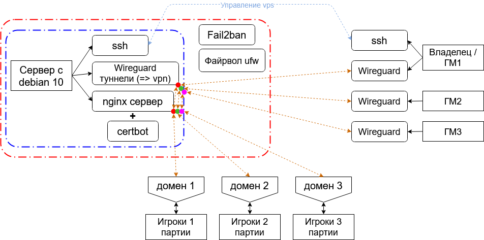

# Прокси-сервер для Foundryvtt (ПК ГМа - Wireguard - nginx) 

This repository provides instructions for configuring a proxy server for Foundryvtt using ssh, Wireguard, nginx, certbot, ufw, fail2ban.
Instructions on

1) Russian: 
[sub-section](./Proxy-server for Foundryvtt (RU).md)  
[sub-section](/Proxy-server for Foundryvtt (RU).md)
[link][./Proxy-server for Foundryvtt (RU).md) 

