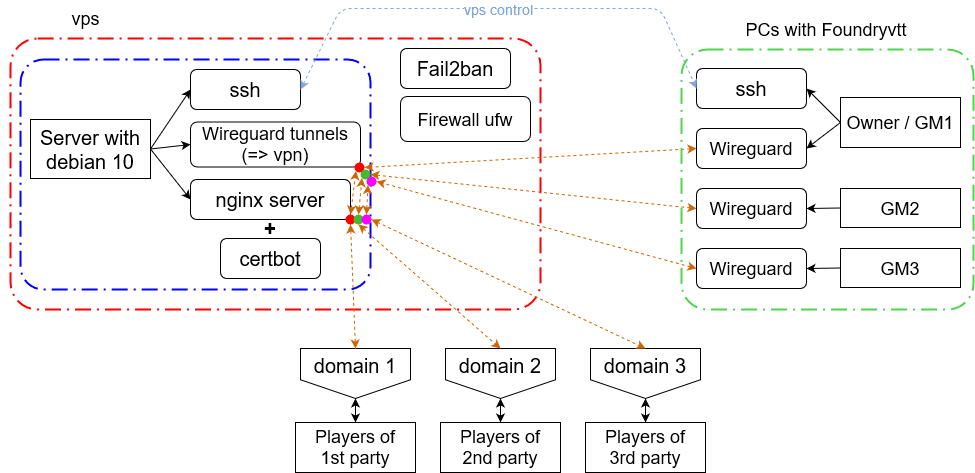
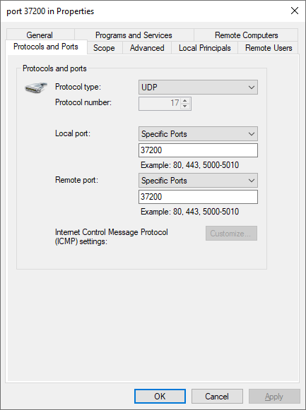
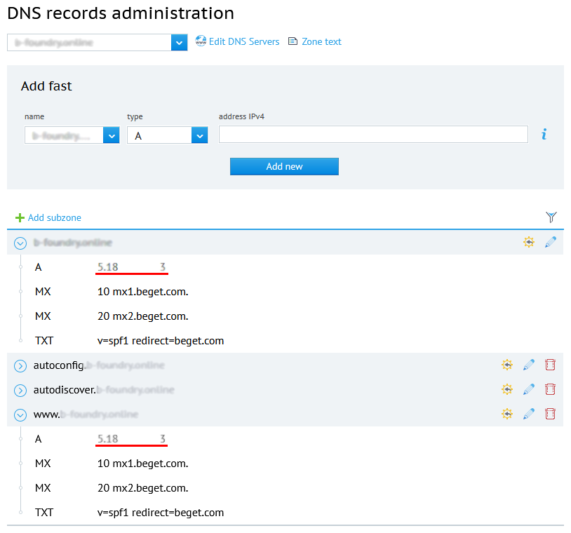

# Reverse proxy server for Foundryvtt (GM's PC - Wireguard - nginx - domain name - player's PC) <!-- omit in toc --> 

Below is the instruction for configuring a server as shared reverse proxy server for several GMs' machines each having Foundryvtt on board. The operating system is debian 10. It proxies traffic from each local GM machine connected to vpn using Wireguard, on the one hand, to a player's computer connected through a browser to a domain in the Internet via a secure https connection, on the other hand (and back). It allows to run games for several GMs at the same time, using one server (while choosing the vps / vds with minimum tariff plan, if the server is rented). 

<details>
<summary>Advantages and disadvantages of this approach (may be subjective)</summary>

The advantages of this approach are that:
1) In comparison with renting a full-fledged server for hosting Foundryvtt, you can minimize costs, because a weak machine is enough to proxy traffic.
2) In comparison with placing Foundryvtt on a remote rented server, in this case you will prepare for games from your personal computer, without wasting time for receiving and sending traffic (if you keep your personal server at home, then, of course, delays are minimized).
3) Compared to hosting Foundryvtt on a personal home server, there is no need to worry about fire safety.
4) Compared to placing Foundryvtt on a personal computer and sharing access to Foundryvtt using nginx, you do not need to re-configure your personal computer to send data over the network in case of reinstalling the operating system, the logic of communication over the network is located on the vps side (not counting ssh and wireguard connection). You just need to install wireguard on the GM's personal computer, add the configuration to it and open the UDP port in the firewall. No additional Foundryvtt configuration is required. Thus, although this guide assumes configuration using ubuntu / debian, if the server is already configured, it requires minimal configuration of GMs' personal computers to use it. 
5) Compared to hosting Foundryvtt on a personal computer and sharing access to Foundryvtt using nginx, here on a personal computer you do not need to open TCP ports 80 (http), 443 (https).
6) Compared to connecting players via a virtual private network, here players do not need to deal with this connection, just go to the domain name in the browser.
7) Allows to use one vps / vds server for several GMs. 

The disadvantages are that:
1) Players will only have access to Foundryvtt when the personal computer is turned on and wireguard and Foundryvtt are running and connected.
2) You will be limited in choosing a provider for vps / vds, because:
    * The server (from experience) makes sense to search within the same city where the master is connected to the Internet (physically). For example, if the master is in St. Petersburg and the server is in Moscow, delays will be noticeable.
    * It also makes sense to choose a provider and tariff in order to have access through vnc in order to have more control over the machine. On the other hand, connection stability and low latency may be more important. 

</details>

These commands are given for a server on debian> = 10, most likely, they are also correct without changes for Ubuntu> = 20 (>=18?), For another distribution you need to make the appropriate adjustments. Server side actions are highlighted with a red circle &#x1F534; at the beginning. On the client side, I used Ubuntu 20, all relevant actions are highlighted in blue &#x1F535; at the beginning (ubuntu was deployed inside a virtualbox virtual machine, the very fact of virtualization does not affect the type of commands). For another system, you will need to make the appropriate changes. 

Briefly about what will be done below: 



## Table of Contents<!-- omit in toc --> 
- [1. vps/vds-provider](#1-vpsvds-provider)
- [2. Server preparation](#2-server-preparation)
- [3. Non-root user, on the server](#3-non-root-user-on-the-server)
- [4. SSH - keys instead of passwords](#4-ssh---keys-instead-of-passwords)
- [5. Firewall](#5-firewall)
- [6. Fail2ban](#6-fail2ban)
- [7. Changing the default ports](#7-changing-the-default-ports)
- [8. Wireguard](#8-wireguard)
  - [8.1. Installation](#81-installation)
  - [8.2. Configuration - Server Side Network Packet Forwarding](#82-configuration---server-side-network-packet-forwarding)
  - [8.3. Writing settings to configuration files](#83-writing-settings-to-configuration-files)
    - [8.3.1. Make configurations' texts manually](#831-make-configurations-texts-manually)
    - [8.3.2. Using a script to generate configurations' files](#832-using-a-script-to-generate-configurations-files)
  - [8.4. VPN](#84-vpn)
  - [8.5. Launch Wireguard Interfaces with Desired Configuration](#85-launch-wireguard-interfaces-with-desired-configuration)
  - [8.6. Opening UDP-port](#86-opening-udp-port)
    - [8.6.1. Debian / Ubuntu](#861-debian--ubuntu)
    - [8.6.2. Windows 10](#862-windows-10)
  - [8.7. Connection test](#87-connection-test)
- [9. Domain registration and binding it to ip of vps](#9-domain-registration-and-binding-it-to-ip-of-vps)
- [10. Deploying an nginx server as a proxy that provides access to one of the peers of the wireguard network on port 30000](#10-deploying-an-nginx-server-as-a-proxy-that-provides-access-to-one-of-the-peers-of-the-wireguard-network-on-port-30000)
  - [10.1. Installing and configuring access via http](#101-installing-and-configuring-access-via-http)
  - [10.2. Installing the Certbot bot for installing and auto-renewing ssl (tls?) - certificates from Let's Encrypt](#102-installing-the-certbot-bot-for-installing-and-auto-renewing-ssl-tls---certificates-from-lets-encrypt)
  - [10.3. Installing and configuring access via https](#103-installing-and-configuring-access-via-https)

## 1. vps/vds-provider

The provider sends a password for the user **root** -
**\<root_password\>** (for example, via email).

User: root

Password: \<root_password\>

Article 1:
<https://habr.com/ru/company/vdsina/blog/521388/>

Article 2:
<https://timeweb.com/ru/help/pages/viewpage.action?pageId=9241442>

&#x1F534; If you want to immediately change the password for root:

```
passwd root
```

> :warning: Hereinafter, it is assumed that we use some VNC-client to control the vps server (parameters for VNC-connection should be in the vps's control panel of provider or in sent email). Then we will shift to using ssh after (at least) ssh-client will be installed on the server side and non-root user will be created.

## 2. Server preparation

We update the list of packages from the repositories and update all installed packages to the current version. 

```
apt-get update

apt-get upgrade
```

## 3. Non-root user, on the server 

Since the root user has absolute privileges in the system, in order to prohibit remote administration using it, we create a non-root user and disable remote administration for root via ssh.
Let's create the user **\<username\>** with a password **\<user_pass\>**: 

```
adduser <username>
```

Here you are asked to enter **\<user_pass\>** //later it can be changed with **passwd \<username\>**

Next, you are asked to specify some information for the new user, you can just press Enter several times and then Y. 

If sudo is not already installed, install it: 

```
apt install sudo
```

Now the user needs to be added to a group that has the right to execute commands with sudo privilege elevation: 

```
usermod -aG sudo <username>
```

//It can be verified that the user has been added to the sudo group: \"vi
/etc/group\" //Close - Esc and \":q\"

//Also a folder should have been created: /home/\<username\>

## 4. SSH - keys instead of passwords 

//ssh authorization:
<https://losst.ru/avtorizatsiya-po-klyuchu-ssh>

//ssh user reminder:
<https://habr.com/ru/post/122445/>

Brute force or password leakage is a standard attack vector, so it is better to disable SSH (Secure Shell) password authentication and use key authentication instead. We use the openssh client. Alternatively there are also, for example, lsh and Dropbear. 

&#x1F535;
Install OpenSSH Client on the client side:

```
sudo apt install openssh-client
```

&#x1F534; Install on the server:

```
sudo apt install openssh-server
```

Let's start the SSH daemon on the server 

```
sudo systemctl start ssh
```

Start the daemon automatically on every boot:

```
sudo systemctl enable ssh
```

Let's create a folder /home/\<username\>/.ssh/

```
mkdir -p /home/<username>/.ssh/
```

Let's create a file authorized_keys

```
touch /home/<username>/.ssh/authorized_keys
```

Checking for file existence:

```
ls -lh /home/<username>/.ssh/authorized_keys
```

Set the correct permissions for the folder and file:

```
chmod 700 /home/<username>/.ssh && chmod 600 /home/<username>/.ssh/authorized_keys
```

Change the owner and group for the directory /home/\<username\>/.ssh to a non-root user:

```
chown -R <username>:<username> /home/<username>/.ssh
```

&#x1F535; Now on the client side,

**> Ubuntu 20:**

create a file with the key \<custom_server_key_file\> and send it to the server so that its contents are written to the file \.../authorized_keys:

```
sudo mkdir -p /root/.ssh/
```

Generate ssh key for server, password for ssh key: \<ssh_key_pass\>

```
sudo ssh-keygen
```

In the process, you are asked to enter the path to the created private and public keys:

> \>sudo ssh-keygen
>
> Generating public/private rsa key pair.
>
> Enter file in which to save the key (/root/.ssh/id_rsa):
> **/root/.ssh/\<custom_server_key_file\>**
>
> Enter passphrase (empty for no passphrase): **\<ssh_key_pass\>**
>
> Enter same passphrase again: **\<ssh_key_pass\>**
>
> Your identification has been saved in
> /root/.ssh/\<custom_server_key_file\>
>
> Your public key has been saved in
> /root/.ssh/\<custom_server_key_file\>.pub
>
> \<\...\>

By default, ssh-keygen likes to drop files into a folder /home/ (?), so the full path needs to be specified, and all subdirectories must exist.

Now we send the public key to the server so it is written to a file /home/\<username\>/.ssh/authorized_keys:

```
sudo ssh-copy-id -i /root/.ssh/<custom_server_key_file>.pub
<username>@<server_ip_address>
```

&#x1F534; You can verify that the key has been sent and written by entering the command on the server side

```
vi /home/<username>/.ssh/authorized_keys
```

&#x1F535; :information_source: At the moment, you can connect to the server from the client side using a password, the key is not used (but it is better not to do this): 

```
ssh <username>@<server_ip_address>
```

&#x1F534; So next we disable remote access using ssh with root and the use of passwords, so we make changes in: 

```
vi /etc/ssh/sshd_config
```

In total, uncomment where necessary and set (in VIM, switch to editing mode by pressing the Insert button, insert text from the clipboard Shift+Insert, delete all text from this position Esc + :.,\$d + Enter, exit without writing :q!): 

```
PermitRootLogin no

PubkeyAuthentication yes

PasswordAuthentication no

ChallengeResponseAuthentication no

UsePAM no
```

Restart the ssh daemon for the changes to take effect: 

```
sudo systemctl restart ssh
```

&#x1F535; :information_source: At the moment, from the client's side, connection to the server is possible with a command (when entering, you are asked for a password **\<ssh_key_pass\>**):

```
sudo ssh <username>@<server_ip_address> -i
/root/.ssh/<custom_server_key_file>
```

This allows you to perform further actions with the server by connecting via ssh by the user \<username\> using the key. 

## 5. Firewall

&#x1F534; The firewall ensures that the traffic can go to the server only via the specified ports. This protects against exploitation of ports that has been accidentally opened with other services, so it greatly reduces the attack surface. 

We will use firewall ufw. If it is not already installed, install it: 

```
sudo apt install ufw
```

Let's add SSH to the list of firewall exceptions (otherwise, after starting the firewall, we are not be able to connect to the server): 

```
sudo ufw allow ssh
```

Now let's start the firewall: 

```
sudo ufw enable
```

Now you can check the status of the firewall by entering: 

```
sudo ufw status
```

Here ufw displays that TCP connection on port 22 is allowed (for ssh the standard port is 22): 22/tcp - ALLOW - Anywhere

In case you need to restart the firewall: 

```
sudo systemctl restart ufw
```

Probably now in the VNC client's panel you can see how actively the outside world is trying to communicate with the server, and messages like "\[UFW BLOCK\]".

If you need a more detailed information about configuring of ufw, this article can help:
<https://1linux.ru/old/fajrvoll-primery-s-iptables-ufw.html>.

## 6. Fail2ban

The Fail2Ban service analyzes the logs on the server and counts the number of access attempts from each IP address. Its settings specify the rules for how many access attempts are allowed for a certain interval - after which this IP address is blocked for a specified period of time. For example, we allow 5 unsuccessful SSH authentication attempts within 2 hours, after which we block this IP address for 12 hours. 

Install fail2ban:

```
sudo apt install fail2ban
```

Let's start the service and configure it to start at system startup: 

```
sudo systemctl start fail2ban

sudo systemctl enable fail2ban
```

The program has two configuration files: /etc/fail2ban/fail2ban.conf and /etc/fail2ban/jail.conf. The ban conditions are specified in the second file. 

Jail for SSH is enabled by default with these default settings (5 attempts, interval 10 minutes, ban for 10 minutes). 

```
[DEFAULT]

ignorecommand =

bantime = 10m

findtime = 10m

maxretry = 5
```

In addition to SSH, Fail2Ban can protect other services on the nginx or Apache web server. 

## 7. Changing the default ports 

For ssh, the default port is 22. To reduce the attack surface (-> <https://habr.com/ru/company/vdsina/blog/521388/>), let's change the port number. 

The port number can be configured by changing the Port 22 directive in the configuration file 

```
sudo vi /etc/ssh/sshd_config
```

Let's put 

```
Port <custom_ssh_port>
```

Restart the ssh daemon again for the changes to take effect: 

```
sudo systemctl restart ssh
```

Now we also need to make the appropriate change for ufw: 

```
sudo ufw allow <custom_ssh_port>/tcp
```

> To roll back: sudo ufw delete allow <custom_ssh_port>/tcp

Now let's remove the rule to allow communication via TCP on port 22:

```
sudo ufw delete allow 22/tcp
```

Check which connections are currently allowed:

```
sudo ufw status
```

<https://www.cyberciti.biz/faq/howto-change-ssh-port-on-linux-or-unix-server/>

&#x1F535; :information_source: Now, in order to remotely connect via ssh, you need to enter the command, taking into account the non-standard port (youa are asked to enter the password <ssh_key_pass>):

```
sudo ssh <username>@<server_ip_address> -i /root/.ssh/<custom_server_key_file> -p <custom_ssh_port>
```

\-\-\-\-\-\--Automatic security updates 

Is it necessary at all? Skipped for now
(<https://linux-audit.com/automatic-security-updates-with-dnf/>).

## 8. Wireguard

<https://www.wireguard.com/quickstart/><br/>
<https://habr.com/ru/post/432686/><br/>
<https://www.linux.org.ru/forum/admin/14321745>

### 8.1. Installation

&#x1F534;&#x1F535; Install Wireguard on the server side and on the client side. Within the network that we deploy, formally both server and clients are peers, but in order for the network to be working, at least one of them (in this case, the "server") must have a "white" ip. So, on the server side and on the client side, let's add the corresponding repository:  

a) if debian \> 10

Adding corresponding repository (add-apt-repository...) have to let installing wireguard, but let's note that this feature does not work until debian 11: 

```
apt-get install software-properties-common
``` 
//the add-apt-repository command is now available:

```
sudo add-apt-repository ppa:wireguard/wireguard
```

b) if debian \~10 (with some nuances 9).

Therefore, for debian with version lower than 11.0, you need to use backports, in the official repositories there is no wireguard. This command tells the package manager to also use the buster-backports repository to find and install packages (and contrib / non-free are the sections where apt will look for the main contributed and non-free software): 

```
sudo sh -c "echo 'deb http://deb.debian.org/debian buster-backports main contrib non-free' > /etc/apt/sources.list.d/buster-backports.list"
```

The repository connection for debian / ubuntu is done. Now let's update the packages: 

```
sudo apt-get update

sudo apt-get upgrade
```

As for ubuntu \>=20 (\>=18?), you already have wireguard in the connected repositories.

Install Wireguard:

```
sudo apt install wireguard
```

Let's make available wg-quick (will be needed further, <https://3dnews.ru/1002719/wireguard-vpn-setup>):

```
sudo apt-get install linux-headers-$(uname -r)
```

//if the package is not immediately found (for example, it happened to me in the case of debian 9), then you need to find and install the closest one: sudo apt-cache search linux-headers (<https://stackoverflow.com/questions/22165929/install-linux-headers-on-debian-unable-to-locate-package>)

### 8.2. Configuration - Server Side Network Packet Forwarding 

&#x1F534; Now let's start configuring Wireguard. 

In order for packets to be redirected to the right place, you need to enable redirection of network packets at the kernel level. To do this, open the file /etc/sysctl.conf and add the following lines to the end (<https://losst.ru/ustanovka-wireguard-v-ubuntu>), the meaning of the directives is given in the comments in the /etc/sysctl.conf file: 

```
sudo vi /etc/sysctl.conf
```

```
net.ipv4.ip_forward = 1
```

Then you need to run the command **sysctl -p** so that the system re-reads the configuration: 

```
sudo sysctl -p
```

### 8.3. Writing settings to configuration files

Now let's create a server configuration file. Choose a port for UDP (Wireguard uses UDP) - **\<custom_wireguard_port\>.**

Server's configuration file (let's call it \<wg_0\>) will be located at the path /etc/wireguard/\<wg_0\>.conf. Client's configuration file will be located at /etc/wireguard/\<wg_N\>.conf (instead of \<wg_N\> you have to use your own name). You need to enter the configuration name in the configuration text in the iptables section and when calling wg-quick.

#### 8.3.1. Make configurations' texts manually

If you prefer to use a script to generate the configuration files, skip to the next step: [8.3.2. Using a script to generate configurations' files](#832-using-a-script-to-generate-configurations-files).

&#x1F535; Let's generate all the public-private key pairs for the Wireguard client-side configurations.

Generating server keys: 

```
wg genkey | sudo tee server_private.key | wg pubkey | sudo tee server_public.key
```

view keys: 

```
cat server_private.key
```

//8JNvz....

```
cat server_public.key
```

//+tYEi\...

I just saved all the keys to myself in turn in a text editor, and then pasted them in the right places in the configuration files, editing the server configuration via ssh. 

Generating client keys: 

```
wg genkey | sudo tee client_private.key | wg pubkey | sudo tee client_public.key

cat client_private.key

cat client_public.key
```

Suppose we need to create a network for N clients (which is not entirely correct, as part of Wireguard all are considered peers), I just took and generated pairs of public and private keys for the client N times and saved to myself in a text editor something like: 

=2

private: UKBSB\...

public: a3L4e\...

Open the configuration file and add the text below: 

```
sudo vi /etc/wireguard/<wg_0>.conf
```

Configuration text for the server:

```
[Interface]

Address = 10.10.0.1/24

ListenPort = <custom_wireguard_port>

PrivateKey = <server_private>

PostUp = iptables -A FORWARD -i <wg_0> -j ACCEPT; iptables -t nat
-A POSTROUTING -o enp0s8 -j MASQUERADE; ip6tables -A FORWARD -i
<wg_0> -j ACCEPT; ip6tables -t nat -A POSTROUTING -o enp0s8 -j
MASQUERADE

PostDown = iptables -D FORWARD -i <wg_0> -j ACCEPT; iptables -t
nat -D POSTROUTING -o enp0s8 -j MASQUERADE; ip6tables -D FORWARD -i
<wg_0> -j ACCEPT; ip6tables -t nat -D POSTROUTING -o enp0s8 -j
MASQUERADE

[Peer]

PublicKey = <client_public_N>

AllowedIPs = 10.10.0.<N+1>/32

[Peer]

PublicKey = <client_public_N+1>

AllowedIPs = 10.10.0.<N+2>/32
```

//Comment: \<custom_wireguard_port \> is also wg_0 in PostUp and PostDown. AllowedIPs is responsible for the routing table and using 32 there, we say that there is only one address on that side. Address is the settings for the network interface, there should be 24, because the whole network has mask 24. 

Now let's create configuration files for clients: 

```
vi client_<N>.conf
```

Configuration text for client N: 

```
[Interface]

PrivateKey = <client_private_N>

Address = 10.10.0.<N+1>/24

[Peer]

PublicKey = <server_public>

Endpoint = <server_ip_address>:<custom_wireguard_port>

AllowedIPs = 10.10.0.0/24

PersistentKeepalive = 25
```

When the PersistentKeepAlive option is enabled, a keepalive packet is sent to the server endpoint once every several seconds. A reasonable interval that works with a wide variety of firewalls is 25 seconds. Setting it to 0 disables this feature, which is the default since most users don't need it, and it makes WireGuard a little more talkative. 

After you have made all the changes, copy the file to the computer of each client under the name /etc/wireguard/\<wg_N\>.conf (instead of \<wg_N\> you need to substitute your name, you will need to use it below when running commands). 

#### 8.3.2. Using a script to generate configurations' files

An alternative option would be to run the script on the client's side. Let's create a script file in the folder \<script_folder\>: 

```
sudo mkdir -p <script_folder>
sudo touch <script_folder>/gen_key
```

Make the file executable:

```
sudo chmod +x <script_folder>/gen_key
```

Open the file and copy the text from the [script file in the repository](gen_keys.sh).
```
sudo vi <script_folder>/gen_key
```

Run it:
```
#sudo <script_folder>/gen_key <script_folder> <wg_0> <peers_number> <server_ip_address> <custom_wireguard_port> <eth0>
```

All keys will be stored in a file \<script_folder\>/keys. 

You need to copy the contents of \<script_folder\>/\<wg_0\>.conf to the server in the file /etc/wireguard/\<wg_0\>.conf. 


### 8.4. VPN

If you want one of the clients to pass all traffic through VPN tunnel, you need to slightly change the setting for its machine:

```
[Interface]
PrivateKey = <client_private_N>
Address = 10.10.0.<N+1>/32
DNS = 8.8.8.8

[Peer]
PublicKey = <server_public>
AllowedIPs = 0.0.0.0/0
Endpoint = <server_ip_address>:<custom_wireguard_port>
PersistentKeepalive = 25
```

### 8.5. Launch Wireguard Interfaces with Desired Configuration 

&#x1F534; Let's start the interfaces on the server and client side, the commands in this block
you will need to run on both sides. For simplicity, I am using the name \<wg_0\>, &#x1F535; for each client there will be a corresponding chosen name \<wg_N\>. If the client is on Windows 10, then you just need to add the configuration file in the Wireguard program ("Add Tunnel"). 

&#x1F534; To launch the interface, use the following command: 

```
sudo wg-quick up <wg_0>
```

//In this case, using wg-quick is similar to a set of the following commands (writes to the console): 

```
~$ sudo wg-quick up <wg_0>

[#] ip link add <wg_0> type wireguard

[#] wg setconf <wg_0> /dev/fd/63

[#] ip -4 address add 10.0.0.2/24 dev <wg_0>

[#] ip link set mtu 1420 up dev <wg_0>
```

Similarly, after the initial configuration, you can then use systemd: 

```
sudo systemctl start wg-quick@<wg_0>
```

With systemd, you can configure the Wireguard interface to autoload with the desired configuration: 

```
sudo systemctl enable wg-quick@<wg_0>
```

//restarting wireguard with the desired configuration: **sudo systemctl restart
wg-quick@\<wg_0\>**

//remove wireguard from startup at startup locally on a debian-like system: **sudo systemctl disable wg-quick@\<wg_0\>**

<details>
<summary>Switching between configurations on debian / ubuntu</summary>
To freely switch between configurations (different available servers or different IP of vpn), first disable / remove all running configurations from startup: 

```
sudo systemctl disable wg-quick@<wg...>
```

Then just start and stop one at a time: 

```
sudo systemctl stop wg-quick@<wg_K>

sudo systemctl start wg-quick@<wg_K+1>
```
</details>

### 8.6. Opening UDP-port

&#x1F535; Everything here depends a lot on the OS used, firewalls, firewalls, etc. (like the entire client part, marked in blue). Wireguard works with udp, so you need to open the appropriate ports to receive and send traffic over UDP. 

#### 8.6.1. Debian / Ubuntu

For the ufw firewall, open UDP-port:

```
sudo ufw allow <custom_wireguard_port>/udp

sudo ufw status
```

#### 8.6.2. Windows 10

On windows 10 for built-in firewall (maybe not enough): 

Open UDP port **\<custom_wireguard_port\>** to out and in for specific program, in a zero approximation, just open the port without being bound to the program. 

Control Panel -\> Windows Defender Firewall -\> Advanced Settings -\> Create two rules for inbound and outbound connections. 



In the case of antivirus, you need to add the virtual network created by Wireguard to the trusted ones. 

### 8.7. Connection test

In order to test connection between peers in wireguard network you can use ping utility.

To test connection from clients to server:
```
ping 10.10.0.1
```

To test connection from server to client:
```
ping 10.10.0.N
```
where N > 1.

## 9. Domain registration and binding it to ip of vps

&#x1F534; Here I will limit myself to an example, after registering a domain with the same provider that owns vps, in the case of Beget, you need to change the A-record for the domain, including for the www subzone, by default Beget has a stub leading to the IP page of beget \"Domain not linked to a directory on the server!\". 



## 10. Deploying an nginx server as a proxy that provides access to one of the peers of the wireguard network on port 30000 

### 10.1. Installing and configuring access via http 

Link:
<https://foundryvtt.com/article/nginx/>

Install nginx:

```
sudo apt-get update

sudo apt-get install nginx
```

In the file **/etc/nginx/sites-available/foundryvtt** I registered the required configuration, in the server_name section you need to specify the registered domain (above), or the level \~3 domain, which was issued by the provider after the start of the vps lease (like "134-XXX.cloudvps.regruhosting.ru"). Hereinafter - **\<domain_name\>**. 

```
sudo vi /etc/nginx/sites-available/foundryvtt
```

```
# Define Server
server {
    # Enter your fully qualified domain name or leave blank
    server_name <domain_name> www.<domain_name>;
    # Listen on port 80 without SSL certificates
    listen 80;
    # Sets the Max Upload size to 300 MB
    client_max_body_size 300M;
    # Proxy Requests to Foundry VTT
    location / {
        # Set proxy headers
        proxy_set_header Host \$host;
        proxy_set_header X-Forwarded-For $proxy_add_x_forwarded_for;
        proxy_set_header X-Forwarded-Proto $scheme;
        # These are important to support WebSockets
        proxy_set_header Upgrade $http_upgrade;
        proxy_set_header Connection "Upgrade";
        # Make sure to set your Foundry VTT port number
        # proxy_pass http://localhost:30000;
        # Wireguard address of the machine on which Foundry is deployed and running 
        proxy_pass http://10.10.0.2:30000;
    }
}
```

&#x1F535; //seems not necessary (works without it in this context), on the client side with Foundry: 

In the user data folder of Foundryvtt in the file **{userData}/Config/options.json** changed: 

```
{
    "port": 30000,
    "upnp": true,
    "fullscreen": false,
    "hostname": "<domain_name>",
    "routePrefix": null,
    "sslCert": null,
    "sslKey": null,
    "awsConfig": null,
    "dataPath": "/home/hm/.local/share/FoundryVTT",
    "proxySSL": false,
    "proxyPort": 80,
    "minifyStaticFiles": false,
    "updateChannel": "release",
    "language": "en.core",
    "world": null
}
```

&#x1F534; Next, let's connect the new site by creating a symbolic link to the configuration in /etc/nginx/sites-enabled/ 

```
sudo ln -s /etc/nginx/sites-available/foundryvtt /etc/nginx/sites-enabled/
```

Checking the configuration file 

```
sudo service nginx configtest
```

Starting nginx 

```
sudo service nginx start
```

<details>
<summary>Stop, restart and delete</summary>

//sudo service nginx stop

//sudo service nginx restart

//sudo nginx -s reload //If you only need to re-read the configuration files 

*(if you need to delete, then this way is wrong, you need to do it in some other way!) If you delete a server configuration like **/etc/nginx/sites-available/\<conf_name\>**, you must also delete all links to it:* 

```
sudo rm /etc/nginx/sites-available/foundryvtt

sudo rm /etc/nginx/sites-enabled/foundryvtt

sudo systemctl restart nginx.service
```

</details>


Also opened the ports on the ufw firewall: 

For http:

```
sudo ufw allow 80/tcp
```

For https:

```
sudo ufw allow 443/tcp

sudo ufw enable
```

Now we check that foundryvtt is accessible via the Internet via the http protocol, if the user (GM) running foundry connected to the required wireguard configuration, and another user (player) went to the address \"**\<domain_name\>**\" ( in this case, the UDP port **\<custom_wireguard_port\>** must be open on the GM machine - is this enough for work?). 

### 10.2. Installing the Certbot bot for installing and auto-renewing ssl (tls?) - certificates from Let's Encrypt 

Next, you need to make access via https, for this we use the certificate from Let's Encrypt and its certbot: <https://certbot.eff.org/lets-encrypt/debianbuster-nginx>

Install snapd:

```
sudo apt update

sudo apt install snapd
```

Make sure the snapd version is up to date: 

```
sudo snap install core; sudo snap refresh core
```

Remove certbot-auto or all Certbot OS packages if they were installed by package managers like apt (since it is recommended to use snapd to install and update certbot): 

```
sudo apt-get remove certbot
```

Install Certbot:

```
sudo snap install --classic certbot
```

Verify that the certbot command can be run: 

```
sudo ln -s /snap/bin/certbot /usr/bin/certbot
```

We will install the certificates automatically (along the way, it will change the configurations of those "sites" for which we will choose to install ssl certificates): 

```
sudo certbot --nginx
```

Description of the "manual" installation option from the link above. 

Let's check the automatic renewal of certificates: 

```
sudo certbot renew --dry-run
```

Manual update of certificates: 
```
sudo certbot renew
```

### 10.3. Installing and configuring access via https 

After installing Certbot automatically, it had to change the configuration(s) like **/etc/nginx/sites-available/foundryvtt**, binding the certificates to them and making a number of other changes, including forced redirection of http requests to https. You can view the completed changes using the command 

```
sudo vi /etc/nginx/sites-available/foundryvtt
```

If a manual installation of certbot was chosen, and these changes were not made (I did not check, maybe in this case, the configurations are being corrected), then you need to do them manually according to <https://foundryvtt.com/article/nginx/>.

Now, if Foundryvtt is running on the GM machine and a connection to Wireguard is made, Foundry should be available in the browser at **\<domain_name\>** via the https protocol. 
