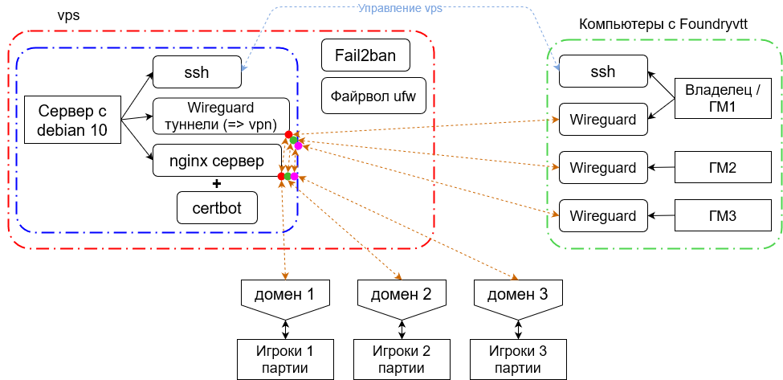
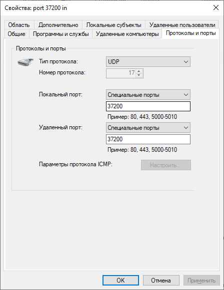
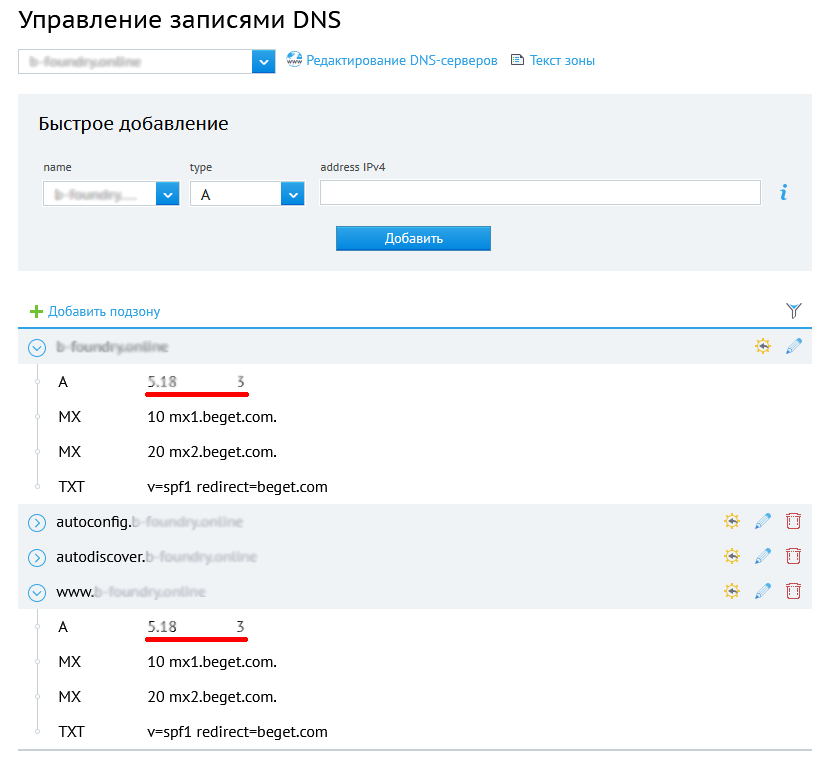

# Обратный прокси-сервер для Foundryvtt (ПК ГМа - Wireguard - nginx - доменное имя - ПК игрока) <!-- omit in toc -->

Ниже приведена инструкция по настройке сервера в качестве общего обратного прокси-сервера для нескольких машин ГМов, на каждой из которых установлен Foundryvtt. Операционная система - debian 10. Он проксирует трафик с локальной машины ГМа, подключенной к vpn с помощью Wireguard, с одной стороны, к компьютеру игрока, подключенного через браузер к домену в интернете по защищенному соединению https, с другой стороны (и обратно). Это позволяет водить партии нескольким ГМам одновременно, используя один сервер (при выборе vps / vds с минимальным тарифным планом, если сервер арендуется).

<details>
<summary>Преимущества и недостатки данного подхода (может быть субъективно)</summary>

Преимуществами данного подхода является то, что:
1) В сравнении с арендой полноценного сервера для размещения Foundryvtt, Вы можете минимизировать затраты, т.к. для проксирования трафика достаточно слабой машины. 
2) В сравнении с размещением Foundryvtt на удалённом арендуемом сервере, готовиться к играм Вы в этом случае будете с вашего персонального компьютера, не тратя время на получение и пересылку трафика (если Вы держите личный сервер дома, то, конечно, задержки минимизированы). 
3) В сравнении с размещением Foundryvtt на личном домашнем сервере, не нужно беспокоиться о пожарной безопасности.
4) В сравнении с размещением Foundryvtt на персональном компьютере и расшариванием доступа к Foundryvtt с помощью nginx, Вам не нужно проводить заново полную настройку личного компьютера для пересылки данных по сети в случае переустановки операционной системы, логика общения по сети расположена на стороне vps (не считая ssh и wireguard подключения). Вам достаточно будет установить на персональном компьютере ГМа wireguard, добавить в нём конфигурацию и открыть UDP-порт в файрволе. Дополнительная настройка Foundryvtt не требуется. Таким образом, хотя данное руководство подразумевает настройку с помощью ubuntu / debian, если сервер уже настроен, чтобы его использовать требуется минимальная настройка персональных компьютеров ГМов.
5) В сравнении с размещением Foundryvtt на персональном компьютере и расшариванием доступа к Foundryvtt с помощью nginx, здесь на личном компьютере не нужно открывать TCP-порты 80 (http), 443 (https).
6) В сравнении с подключением игроков через виртуальную частную сеть, здесь игрокам не нужно разбираться с этим подключением, достаточно зайти по доменному имени в браузере.
7) Позволяет использовать один сервер vps/vds нескольким ГМам.

Недостатками является то, что:
1) Игроки будут иметь доступ к Foundryvtt только тогда, когда включён персональный компьютер, и запущены и подключены wireguard и Foundryvtt.
2) Вы будете ограничены в выборе провайдера для vps/vds, поскольку:
    * Сервер (по опыту) имеет смысл искать в пределах того же города, где мастер подключён к интернету (физически). Например, если мастер в СПб, а сервер в Москве, задержки будут заметны.
    * Также имеет смысл подбирать провайдера и тариф, чтобы иметь доступ через vnc, чтобы иметь больше контроля над машиной. С другой стороны, стабильность соединения и малые задержки могут быть важнее.

</details>

Данные команды приведены для сервера на debian >=10, скорее всего, они также без изменений корректны для Ubuntu >=20 (>=18?), для другого дистрибутива нужно внести соответствующие корректировки. Действия на стороне сервера выделены красным кругом &#x1F534; в начале. На стороне клиента использовалась Ubuntu 20, все соответствующие действия выделены синим кругом &#x1F535; в начале (ubuntu была развернута внутри виртуальной машины virtualbox, сам факт виртуализации на вид команд не влияет). Для другой системы нужно будет сделать соответствующие изменения. 

Кратко о том, что будет сделано ниже:



## Оглавление<!-- omit in toc --> 
- [1. vps/vds-провайдер](#1-vpsvds-провайдер)
- [2. Подготовка сервера](#2-подготовка-сервера)
- [3. Нерутовый юзер, на сервере](#3-нерутовый-юзер-на-сервере)
- [4. Ключи вместо паролей SSH](#4-ключи-вместо-паролей-ssh)
- [5. Файрвол](#5-файрвол)
- [6. Fail2ban](#6-fail2ban)
- [7. Смена портов по умолчанию](#7-смена-портов-по-умолчанию)
- [8. Wireguard](#8-wireguard)
  - [8.1. Установка](#81-установка)
  - [8.2. Настройка - перенаправление сетевых пакетов на стороне сервера](#82-настройка---перенаправление-сетевых-пакетов-на-стороне-сервера)
  - [8.3. Запись настроек в файлы конфигураций](#83-запись-настроек-в-файлы-конфигураций)
    - [8.3.1. Пропишем вручную](#831-пропишем-вручную)
    - [8.3.2. Использование скрипта для генерации файлов настроек](#832-использование-скрипта-для-генерации-файлов-настроек)
  - [8.4. Запуск интерфейсов Wireguard с нужной конфигурацией](#84-запуск-интерфейсов-wireguard-с-нужной-конфигурацией)
  - [8.5. Открытие UDP-порта](#85-открытие-udp-порта)
    - [8.5.1. Debian / Ubuntu](#851-debian--ubuntu)
    - [8.5.2. Windows 10](#852-windows-10)
  - [8.6. Проверка соединения](#86-проверка-соединения)
- [9. Регистрация домена и привязка его к ip vps'а](#9-регистрация-домена-и-привязка-его-к-ip-vpsа)
- [10. Развёртывание nginx сервера, как прокси, который предоставляет доступ к одному из пиров сети wireguard по порту 30000](#10-развёртывание-nginx-сервера-как-прокси-который-предоставляет-доступ-к-одному-из-пиров-сети-wireguard-по-порту-30000)
  - [10.1. Установка и настройка доступа через http](#101-установка-и-настройка-доступа-через-http)
  - [10.2. Установка бота Certbot для установки и автообновления ssl(tls?)-сертификатов от Let's Encrypt](#102-установка-бота-certbot-для-установки-и-автообновления-ssltls-сертификатов-от-lets-encrypt)
  - [10.3. Установка и настройка доступа через https](#103-установка-и-настройка-доступа-через-https)

## 1. vps/vds-провайдер

Провайдер предоставит пароль для пользователя **root** -
**\<root_password\>** (допустим, по почте).

Пользователь: root

Пароль: \<root_password\>

Статья на хабре:
<https://habr.com/ru/company/vdsina/blog/521388/>

Статья 2:
<https://timeweb.com/ru/help/pages/viewpage.action?pageId=9241442>

&#x1F534; Если нужно сразу сменить пароль для root:

```
passwd root
```

> :warning: Здесь и далее предполагается, что для управления vps сервером мы используем некоторый VNC-клиент (параметры VNC-соединения должны быть в панели управления vps провайдера или в отправленном провайдером письме). Мы сможем перейти к использованию ssh после того, как (по крайней мере) ssh-client будет установлен на стороне сервера и будет создан пользователь без полномочий root. 

## 2. Подготовка сервера

Обновляем список пакетов из репозиториев, обновляем все установленные пакеты до актуальной версии.

```
apt-get update

apt-get upgrade
```

## 3. Нерутовый юзер, на сервере

Поскольку у пользователя root абсолютные привилегии в системе, то, чтобы запретить ему удалённое администрирование, создадим нерутового пользователя, а для root отключим удалённое администрирование по ssh. Придумываем нерутового пользователя **\<username\>** и пароль для него **\<user_pass\>**:

```
adduser <username>
```

При этом сразу попросит ввести **\<user_pass\>** //позже можно сменить с помощью **passwd \<username\>**

Дальше попросит указать некоторую информацию для нового пользователя, можно просто несколько раз нажать Enter и затем Y.

Если sudo ещё не установлен, установим его:

```
apt install sudo
```

Теперь пользователя нужно добавить в группу, которая имеет право выполнять команды с повышением привилегий sudo:

```
usermod -aG sudo <username>
```

//Можно проверить, что пользователь был добавлен в группу sudo: \"vi /etc/group\" //закрыть Esc и \":q\"

//Параллельно в /home/ должна была появиться папка \<username\>

## 4. Ключи вместо паролей SSH

//авторизация по ssh:
<https://losst.ru/avtorizatsiya-po-klyuchu-ssh>

//памятка пользователю ssh:
<https://habr.com/ru/post/122445/>

Брутфорс или утечка паролей - стандартный вектор атаки, так что аутентификацию по паролям в SSH (Secure Shell) лучше отключить, а вместо неё использовать аутентификацию по ключам. Используем клиент openssh. В качестве альтернативы есть также, например, lsh и Dropbear.

&#x1F535;
Установка клиента OpenSSH на Ubuntu:

```
sudo apt install openssh-client
```

&#x1F534; Установим на сервере:

```
sudo apt install openssh-server
```

Запустим демона SSH на сервере

```
sudo systemctl start ssh
```

Автоматический запуск демона при каждой загрузке:

```
sudo systemctl enable ssh
```

Создадим папку /home/\<username\>/.ssh/

```
mkdir -p /home/<username>/.ssh/
```

Создадим в ней файл authorized_keys

```
touch /home/<username>/.ssh/authorized_keys
```

Проверка существования файла:

```
ls -lh /home/<username>/.ssh/authorized_keys
```

установим корректные разрешения для папки и файла:

```
chmod 700 /home/<username>/.ssh && chmod 600 /home/<username>/.ssh/authorized_keys
```

Изменим владельца и группу для каталога /home/\<username\>/.ssh на нерутового пользователя:

```
chown -R <username>:<username> /home/<username>/.ssh
```

&#x1F535; Теперь на стороне клиента,

**> Ubuntu 20:**

создадим файл с ключом \<custom_server_key_file\> и отправим его на сервер, чтобы его содержимое было записано в файл \.../authorized_keys:

```
sudo mkdir -p /root/.ssh/
```

Генерирую ssh-ключ для сервера, пароль для ssh-ключа: \<ssh_key_pass\>

```
sudo ssh-keygen
```

В процессе попросит ввести путь до создаваемых приватного и публичного ключей:

> \>sudo ssh-keygen
>
> Generating public/private rsa key pair.
>
> Enter file in which to save the key (/root/.ssh/id_rsa):
> **/root/.ssh/\<custom_server_key_file\>**
>
> Enter passphrase (empty for no passphrase): **\<ssh_key_pass\>**
>
> Enter same passphrase again: **\<ssh_key_pass\>**
>
> Your identification has been saved in
> /root/.ssh/\<custom_server_key_file\>
>
> Your public key has been saved in
> /root/.ssh/\<custom_server_key_file\>.pub
>
> \<\...\>

По умолчанию ssh-keygen любит кидать файлы в папку /home/ (?), поэтому нужно забивать полный путь, и все поддиректории должны существовать.

Теперь перешлём публичный ключ серверу, чтобы он записал содержимое в файл /home/\<username\>/.ssh/authorized_keys:

```
sudo ssh-copy-id -i /root/.ssh/<custom_server_key_file>.pub
<username>@<server_ip_address>
```

&#x1F534; Можно проверить, что ключ "дошёл", для этого на стороне сервера введём команду

```
vi /home/<username>/.ssh/authorized_keys
```

&#x1F535; :information_source: В данный момент можно подключиться к серверу со стороны клиента по паролю, ключ не задействован (но лучше этого не делать):

```
ssh <username>@<server_ip_address>
```

&#x1F534; Поэтому далее отключаем удаленный заход с помощью ssh из-под рута и использование паролей, для этого правим:

```
vi /etc/ssh/sshd_config
```

Итого раскомментировать, где нужно, и установить (в VIM переход в режим редактирования нажатием кнопки Insert, вставка текста из буфера обмена Shift+Insert, удаление всего текста с данной позиции Esc + :.,\$d +
Enter, выход без записи :q!):

```
PermitRootLogin no

PubkeyAuthentication yes

PasswordAuthentication no

ChallengeResponseAuthentication no

UsePAM no
```

Перезапустим демон ssh, чтобы изменения вступили в силу:

```
sudo systemctl restart ssh
```

&#x1F535; :information_source: В данный момент со стороны клиента подключение к серверу возможно командой (при входе попросит ввести пароль **\<ssh_key_pass\>**):

```
sudo ssh <username>@<server_ip_address> -i
/root/.ssh/<custom_server_key_file>
```

Это позволяет осуществлять дальнейшие действия с сервером, подключившись через ssh пользователем \<username\> по ключу.

## 5. Файрвол

&#x1F534; Файрвол гарантирует, что на сервер пойдёт только тот трафик по тем портам, которые вы напрямую разрешили. Это защищает от эксплуатации портов, которые случайно включились с другими сервисами, то есть сильно уменьшает поверхность атаки.

В качестве файрвола воспользуемся ufw. Если он ещё не установлен, установим его: 

```
sudo apt install ufw
```

Внесём SSH в список исключений файрвола (иначе после запуска файрвола мы не сможем подключиться к серверу):

```
sudo ufw allow ssh
```

Теперь запустим файрвол:

```
sudo ufw enable
```

Теперь можно проверить статус файрвола, введя:

```
sudo ufw status
```

ufw отобразит, что TCP-подключение по порту 22 разрешено (для ssh стандартный порт 22): 22/tcp - ALLOW - Anywhere

В случае, если понадобится перезапуск файрвола:

```
sudo systemctl restart ufw
```

Вероятно, теперь в панели VNC-клиента станет видно, как активно внешний мир пытается общаться с сервером, и начнут появляться сообщения вида "\[UFW BLOCK\]".

Если возникнет потребность в более детальной настройке ufw, может пригодиться эта статья:
<https://1linux.ru/old/fajrvoll-primery-s-iptables-ufw.html>.

## 6. Fail2ban

Сервис Fail2Ban анализирует логи на сервере и подсчитывает количество попыток доступа с каждого IP-адреса. В настройках указаны правила, сколько попыток доступа разрешено за определённый интервал --- после чего данный IP-адрес блокируется на заданный отрезок времени. Например, разрешаем 5 неудачных попыток аутентификации по SSH в промежуток 2 часа, после чего блокируем данный IP-адрес на 12 часов.

Установим fail2ban:

```
sudo apt install fail2ban
```

Запустим и установим запуск при старте системы:

```
sudo systemctl start fail2ban

sudo systemctl enable fail2ban
```

В программе два конфигурационных файла: /etc/fail2ban/fail2ban.conf и /etc/fail2ban/jail.conf. Ограничения для бана указываются во втором файле.

Джейл для SSH включён по умолчанию с дефолтными настройками (5 попыток, интервал 10 минут, бан на 10 минут).

```
[DEFAULT]

ignorecommand =

bantime = 10m

findtime = 10m

maxretry = 5
```

Кроме SSH, Fail2Ban может защищать и другие сервисы на веб-сервере nginx или Apache.

## 7. Смена портов по умолчанию

Для ssh номер порта 22 задан по умолчанию. Чтобы уменьшить поверхность атаки (-> <https://habr.com/ru/company/vdsina/blog/521388/>), изменим номер порта.

Номер порта можно настроить, изменив директиву Port 22 в файле конфигурации

```
sudo vi /etc/ssh/sshd_config
```

Поставим

```
Port <custom_ssh_port>
```

Ещё раз перезапустим демон ssh, чтобы изменения вступили в силу:

```
sudo systemctl restart ssh
```

Теперь также нужно внести соответствующее изменение для ufw:

```
sudo ufw allow <custom_ssh_port>/tcp
```

Чтобы откатить обратно: sudo ufw delete allow <custom_ssh_port>/tcp

Теперь удалим правило на разрешение общения через TCP по 22 порту:

```
sudo ufw delete allow 22/tcp
```

Проверить, какие подключения в данный момент разрешены:

```
sudo ufw status
```

<https://www.cyberciti.biz/faq/howto-change-ssh-port-on-linux-or-unix-server/>

&#x1F535; :information_source: Теперь, чтобы удалённо подключиться по ssh, нужно ввести команду, с учётом нестандартного порта (при входе попросит ввести пароль <ssh_key_pass>):

```
sudo ssh <username>@<server_ip_address> -i /root/.ssh/<custom_server_key_file> -p <custom_ssh_port>
```

\-\-\-\-\-\--Автоматические обновления безопасности

Нужно ли это вообще? Пока пропустил
(<https://linux-audit.com/automatic-security-updates-with-dnf/>).

## 8. Wireguard

<https://www.wireguard.com/quickstart/><br/>
<https://habr.com/ru/post/432686/><br/>
<https://www.linux.org.ru/forum/admin/14321745>

### 8.1. Установка

&#x1F534;&#x1F535; Установим Wireguard на стороне сервера и на стороне клиента. В рамках сети, которую мы развернём, оба будут формально являться пирами, но, чтобы сеть "работала", как минимум у одного из них (в данной случае у "сервера") должен быть "белый" ip. Итак, на стороне сервера и на стороне клиента, добавим соответствующий репозиторий:

а) если debian \> 10

Прямыми руками - например, если добавить соответствующий репозиторий через add-apt-repository, но эта возможность до debian 11 работать не будет:

```
apt-get install software-properties-common
``` 
//теперь доступна команда add-apt-repository

```
sudo add-apt-repository ppa:wireguard/wireguard
```

б) если debian \~10 (с оговорками 9).

Поэтому до debian 11.0 нужно использовать бэкпорты, в оф. репозиториях wireguard нет. Эта строка говорит пакет-менеджеру, что нужно использовать также репозиторий buster-backports для поиска и установки пакетов (а contrib / non-free - разделы в которых apt будет искать главный contributed и несвободный софт):

```
sudo sh -c "echo 'deb http://deb.debian.org/debian buster-backports main contrib non-free' > /etc/apt/sources.list.d/buster-backports.list"
```

Подключение репозитория для debian / ubuntu сделано. Теперь обновим пакеты:

```
sudo apt-get update

sudo apt-get upgrade
```

Что касается ubuntu \>=20 (\>=18?), то wireguard уже должен быть в подключенных репозиториях. 

Установим Wireguard:

```
sudo apt install wireguard
```

Сделаем доступной wg-quick (понадобится дальше,
<https://3dnews.ru/1002719/wireguard-vpn-setup>):

```
sudo apt-get install linux-headers-$(uname -r)
```

//если пакет сходу не находит (например, у меня так случилось в случае debian 9), то нужно найти и установить ближайший: sudo apt-cache search linux-headers
(<https://stackoverflow.com/questions/22165929/install-linux-headers-on-debian-unable-to-locate-package>)

### 8.2. Настройка - перенаправление сетевых пакетов на стороне сервера

&#x1F534; Теперь приступим к настройке Wireguard.

Для того, чтобы пакеты перенаправлялись туда, куда надо, нужно разрешить перенаправление сетевых пакетов на уровне ядра. Для этого откроем файл /etc/sysctl.conf и добавим в конец такие строки
(<https://losst.ru/ustanovka-wireguard-v-ubuntu>):

```
sudo vi /etc/sysctl.conf
```

```
net.ipv4.ip_forward = 1

net.ipv6.conf.default.forwarding = 1

net.ipv6.conf.all.forwarding = 1

net.ipv4.conf.all.rp_filter = 1

net.ipv4.conf.default.proxy_arp = 0

net.ipv4.conf.default.send_redirects = 1

net.ipv4.conf.all.send_redirects = 0
```

Затем необходимо выполнить команду sysctl -p, чтобы система перечитала конфигурацию:

```
sudo sysctl -p
```

### 8.3. Запись настроек в файлы конфигураций

Теперь создадим конфигурационный файл сервера. Выберем порт для UDP (Wireguard использует UDP) - **\<custom_wireguard_port\>.**

Конфигурационный файл сервера (назовём его \<wg_0\>) будет находится по пути /etc/wireguard/\<wg_0\>.conf. Конфигурационный файл клиента будет размещён в /etc/wireguard/\<wg_N\>.conf (вместо \<wg_N\> нужно подставить своё название). Название конфигурации нужно будет внести в текст конфигурации в настройках iptables и при вызове wg-quick.

#### 8.3.1. Пропишем вручную

Если вы предпочитаете воспользоваться скриптом для генерации файлов настроек, переходите к следующему пункту: [8.3.2. Использование скрипта для генерации файлов настроек](#832-использование-скрипта-для-генерации-файлов-настроек). 

&#x1F535; Сгенерируем все пары публичный - приватный ключ для конфигураций Wireguard на стороне клиента.
Генерация ключей сервера:

```
wg genkey | sudo tee server_private.key | wg pubkey | sudo tee server_public.key
```

просмотреть ключи:

```
cat server_private.key
```

//8JNvz....

```
cat server_public.key
```

//+tYEi\...

Я просто сохранял себе все ключи по очереди в текстовый редактор, а потом вставлял в нужные места в файлах конфигурации, правя конфигурацию сервера через ssh.

Генерация ключей клиента:

```
wg genkey | sudo tee client_private.key | wg pubkey | sudo tee client_public.key

cat client_private.key

cat client_public.key
```

Пусть нам нужно создать сеть на N клиентов (что не совсем корректно, в рамках Wireguard все считаются пирами), я просто взял и сгенерировал себе пары публичный и приватный ключи для клиента N раз и сохранил себе в текстовый редактор что-то типа:

=2

private: UKBSB\...

public: a3L4e\...

Конфигурационный файл сервера будет выглядеть следующим образом:

```
sudo vi /etc/wireguard/<wg_0>.conf
```

Текст конфигурации для сервера:

```
[Interface]

Address = 10.10.0.1/24

ListenPort = <custom_wireguard_port>

PrivateKey = <server_private>

PostUp = iptables -A FORWARD -i <wg_0> -j ACCEPT; iptables -t nat
-A POSTROUTING -o enp0s8 -j MASQUERADE; ip6tables -A FORWARD -i
<wg_0> -j ACCEPT; ip6tables -t nat -A POSTROUTING -o enp0s8 -j
MASQUERADE

PostDown = iptables -D FORWARD -i <wg_0> -j ACCEPT; iptables -t
nat -D POSTROUTING -o enp0s8 -j MASQUERADE; ip6tables -D FORWARD -i
<wg_0> -j ACCEPT; ip6tables -t nat -D POSTROUTING -o enp0s8 -j
MASQUERADE

[Peer]

PublicKey = <client_public_N>

AllowedIPs = 10.10.0.<N+1>/32

[Peer]

PublicKey = <client_public_N+1>

AllowedIPs = 10.10.0.<N+2>/32
```

//Комментарий: \<custom_wireguard_port\> также является wg_0 в PostUp и PostDown. AllowedIPs отвечает за таблицу роутинга и, используя там 32,
мы говорим, что на той стороне только один адрес. Address - это настройки для сетевого интерфейса, тут должно быть 24, т.к. у всей сети 24 маска.

Теперь создадим конфигурационные файлы для клиентов:

```
vi client_<N>.conf
```

Текст конфигурации для N-го клиента:

```
[Interface]

PrivateKey = <client_private_N>

Address = 10.10.0.<N+1>/24

[Peer]

PublicKey = <server_public>

Endpoint = <server_ip_address>:<custom_wireguard_port>

AllowedIPs = 10.10.0.0/24

PersistentKeepalive = 25
```

Когда опция PersistentKeepAlive включена, пакет keepalive отправляется на конечную точку сервера один раз в некотором интервале секунд. Разумный интервал, который работает с широким спектром межсетевых экранов, составляет 25 секунд. Установка его равным 0 отключает эту функцию, что является значением по умолчанию, поскольку большинству пользователей это не нужно, и она делает WireGuard немного более разговорчивым.

После того, как вы внесли все изменения, скопируйте файл на компьютер каждого клиента под именем /etc/wireguard/\<wg_N\>.conf.

#### 8.3.2. Использование скрипта для генерации файлов настроек

Альтернативным вариантом будет запустить скрипт на компьютере клиента. Создадим файл скрипта в папке \<script_folder\>: 

```
sudo mkdir -p <script_folder>
sudo touch <script_folder>/gen_key
```

Сделаем файл исполняемым:

```
sudo chmod +x <script_folder>/gen_key
```

Откроем файл и скопируем туда текст из [файла скрипта в репозитории](gen_keys.sh).
```
sudo vi <script_folder>/gen_key
```

Запустим:
```
#sudo <script_folder>/gen_key <script_folder> <wg_0> <peers_number> <server_ip_address> <custom_wireguard_port>
```

Все ключи будут храниться в файле \<script_folder\>/keys. 

Содержимое \<script_folder\>/\<wg_0\>.conf нужно скопировать на сервер в файл /etc/wireguard/\<wg_0\>.conf. Содержимое \<script_folder\>/client_\<N\>.conf нужно скопировать на машину клиента в файл /etc/wireguard/\<wg_N\>.conf.

### 8.4. Запуск интерфейсов Wireguard с нужной конфигурацией

&#x1F534; Запустим интерфейсы на стороне сервера и клиента, команды в данном блоке нужно будет запустить и на той, и на другой стороне. Для простоты я использую название \<wg_0\>, &#x1F535; для каждого клиента будет соответствующее выбранное название \<wg_N\>. Если клиент на Windows 10, то нужно просто добавить файл конфигурации в программе Wireguard ("Добавить туннель").

&#x1F534; Для запуска интерфейса используем такую команду:

```
sudo wg-quick up <wg_0>
```

//При этом wg-quick аналогично набору следующих команд (пишет в консоли):

```
~$ sudo wg-quick up <wg_0>

[#] ip link add <wg_0> type wireguard

[#] wg setconf <wg_0> /dev/fd/63

[#] ip -4 address add 10.0.0.2/24 dev <wg_0>

[#] ip link set mtu 1420 up dev <wg_0>
```

Аналогично после первичной настройки далее можно будет использовать systemd:

```
sudo systemctl start wg-quick@<wg_0>
```

С помощью systemd можно настроить автозагрузку интерфейса Wireguard с нужной конфигурацией:

```
sudo systemctl enable wg-quick@<wg_0>
```

//перезапуск wireguard с нужной конфигурацией: **sudo systemctl restart wg-quick@\<wg_0\>**

//убрать wireguard из запуска при старте локально на debian-подобной системе: **sudo systemctl disable wg-quick@\<wg_0\>**

<details>
<summary>Переключение между конфигурациями на debian / ubuntu</summary>
Чтобы свободно переключаться между конфигурациями (разные доступные серверы или разные IP виртуальной локальной сети), вначале отключим/уберём из автозагрузки все запущенные конфигурации:

```
sudo systemctl disable wg-quick@<wg...>
```

Затем просто поочередно запускать и останавливать нужные:

```
sudo systemctl stop wg-quick@<wg_K>

sudo systemctl start wg-quick@<wg_K+1>
```
</details>

### 8.5. Открытие UDP-порта

&#x1F535; Здесь всё сильно зависит от используемой ОС, брандмауэров, файрволов, проч (как и вся клиентская часть, отмеченная синим). Wireguard работает с udp, поэтому нужно открыть соответствующие порты для получения и отправки трафика через UDP.

#### 8.5.1. Debian / Ubuntu

Для файрвола ufw открыть UDP-порт:

```
sudo ufw allow <custom_wireguard_port>/udp

sudo ufw status
```

#### 8.5.2. Windows 10

На windows 10 для встроенного брандмауэра (возможно, не достаточно):

Открыть UDP порт **\<custom_wireguard_port\>** на out и in в такой-то программе, в нулевом приближении просто открыть порт без привязки к программе.

Панель управления -\> Брандмауэр Защитника Windows -\> Дополнительные параметры -\> Создать два правила для входящих и исходящих подключений.



В случае антивируса, нужно добавить виртуальную сеть, создаваемую Wireguard, в доверенные.

### 8.6. Проверка соединения

Чтобы проверить соединение между пирами в сети Wireguard, вы можете использовать утилиту ping.

Чтобы проверить соединение клиентов с сервером:
```
ping 10.10.0.1
```

Чтобы проверить соединение от сервера к клиенту:
```
ping 10.10.0.N
```
где N > 1. 

## 9. Регистрация домена и привязка его к ip vps'а

&#x1F534; Здесь ограничусь примером, после регистрации домена у того же провайдера, которому принадлежит vps, в случае beget нужно изменить A-запись для домена, в т.ч для подзоны www, по умолчанию у beget стоит заглушка, ведущая на IP страницы beget \"Домен не прилинкован к директории на сервере!\".



## 10. Развёртывание nginx сервера, как прокси, который предоставляет доступ к одному из пиров сети wireguard по порту 30000

### 10.1. Установка и настройка доступа через http

Ссылка:
<https://foundryvtt.com/article/nginx/>

Установить nginx:

```
sudo apt-get update

sudo apt-get install nginx
```

В файле **/etc/nginx/sites-available/foundryvtt** прописал нужную конфигурацию, в разделе server_name нужно указать зарегистрированный домен (выше), либо домен \~3 уровня, который выдан провайдером после начала аренды vps (типа "134-X-X-X.cloudvps.regruhosting.ru"). Далее -
**\<domain_name\>**.

```
sudo vi /etc/nginx/sites-available/foundryvtt
```

```
# Define Server
server {
    # Enter your fully qualified domain name or leave blank
    server_name <domain_name> www.<domain_name>;
    # Listen on port 80 without SSL certificates
    listen 80;
    # Sets the Max Upload size to 300 MB
    client_max_body_size 300M;
    # Proxy Requests to Foundry VTT
    location / {
        # Set proxy headers
        proxy_set_header Host \$host;
        proxy_set_header X-Forwarded-For $proxy_add_x_forwarded_for;
        proxy_set_header X-Forwarded-Proto $scheme;
        # These are important to support WebSockets
        proxy_set_header Upgrade $http_upgrade;
        proxy_set_header Connection "Upgrade";
        # Make sure to set your Foundry VTT port number
        # proxy_pass http://localhost:30000;
        # адрес Wireguard машины, на которой развёрнут и запущен Foundry
        proxy_pass http://10.10.0.2:30000;
    }
}
```

&#x1F535; //похоже, не обязательно (работает и без этого в данном контексте), на стороне клиента с Foundry:

В user data папке Foundryvtt в файле **{userData}/Config/options.json** изменил:

```
{
    "port": 30000,
    "upnp": true,
    "fullscreen": false,
    "hostname": "<domain_name>",
    "routePrefix": null,
    "sslCert": null,
    "sslKey": null,
    "awsConfig": null,
    "dataPath": "/home/hm/.local/share/FoundryVTT",
    "proxySSL": false,
    "proxyPort": 80,
    "minifyStaticFiles": false,
    "updateChannel": "release",
    "language": "en.core",
    "world": null
}
```

&#x1F534; Дальше подключим новый сайт, создав символьную ссылку на конфигурацию в /etc/nginx/sites-enabled/

```
sudo ln -s /etc/nginx/sites-available/foundryvtt /etc/nginx/sites-enabled/
```

Проверка файла конфигурации

```
sudo service nginx configtest
```

Запуск nginx

```
sudo service nginx start
```

<details>
<summary>Остановка, перезагрузка и удаление</summary>

//sudo service nginx stop

//sudo service nginx restart

//sudo nginx -s reload //Если нужно только перечитать конфигурационные файлы

*(если удалять, то не так, нужно как-то аккуратнее!) В случае удаления конфигурации сервера вида **/etc/nginx/sites-available/\<conf_name\>** нужно также удалить все ссылки на неё:*

```
sudo rm /etc/nginx/sites-available/foundryvtt

sudo rm /etc/nginx/sites-enabled/foundryvtt

sudo systemctl restart nginx.service
```

</details>

Также открыл порты у файрвола ufw:

Для http:

```
sudo ufw allow 80/tcp
```

Для https:

```
sudo ufw allow 443/tcp

sudo ufw enable
```

Теперь проверяем, что foundryvtt доступен через сеть интернет по протоколу http, если пользователь (ГМ) с запущенной foundry подключился к нужной конфигурации wireguard, а другой пользователь (игрок) зашёл по
адресу \"**\<domain_name\>**\" (при этом порт UDP
**\<custom_wireguard_port\>** должен быть открыт на машине ГМа, - достаточно ли этого для работы?).

### 10.2. Установка бота Certbot для установки и автообновления ssl(tls?)-сертификатов от Let's Encrypt

Далее нужно сделать доступ через https, для этого используем сертификат от Let's Encrypt и его certbot:
<https://certbot.eff.org/lets-encrypt/debianbuster-nginx>

Установим snapd:

```
sudo apt update

sudo apt install snapd
```

Убедимся, что версия snapd актуальна:

```
sudo snap install core; sudo snap refresh core
```

Удалим certbot-auto или все пакеты Certbot OS, если они были установлены менеджерами пакетов типо apt (т.к. для установки и обновления certbot рекомендуется использовать snapd):

```
sudo apt-get remove certbot
```

Установим Certbot:

```
sudo snap install --classic certbot
```

Убедимся, что команда certbot может быть запущена:

```
sudo ln -s /snap/bin/certbot /usr/bin/certbot
```

Установим сертификаты автоматически (попутно он изменит конфигурации тех "сайтов", для которых мы выберем установку ssl-сертификатов):

```
sudo certbot --nginx
```

Описание "ручного" варианта установки по ссылке выше.

Проверим автоматическое обновление сертификатов:

```
sudo certbot renew --dry-run
```

### 10.3. Установка и настройка доступа через https

После автоматической установки Certbot он должен был изменить
конфигурацию(и) типа **/etc/nginx/sites-available/foundryvtt**, привязав им сертификаты и сделав ряд других изменений, в том числе принудительное перенаправление http-запросов на https. Просмотреть совершенные изменения можно с помощью команды

```
sudo vi /etc/nginx/sites-available/foundryvtt
```

Если была выбрана ручная установка certbot, и эти изменения не были совершены (не проверял, может, и в этом случае правит конфигурации), то нужно сделать их вручную согласно
<https://foundryvtt.com/article/nginx/>.

Теперь, если на машине ГМа запущен Foundryvtt, и сделано подключение к Wireguard, Foundry должен быть доступен в браузере по адресу
**\<domain_name\>** через протокол https.
